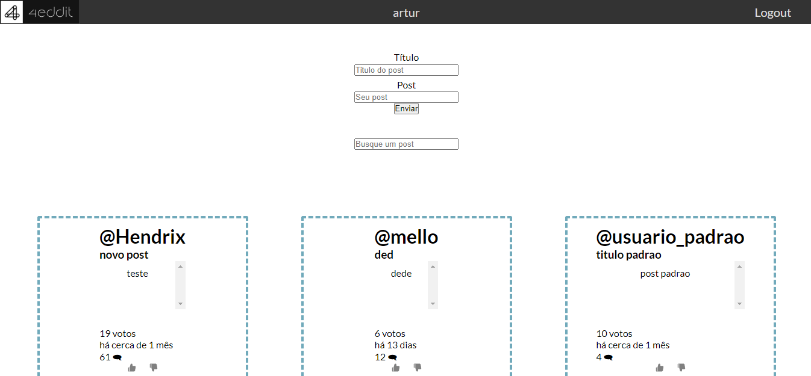
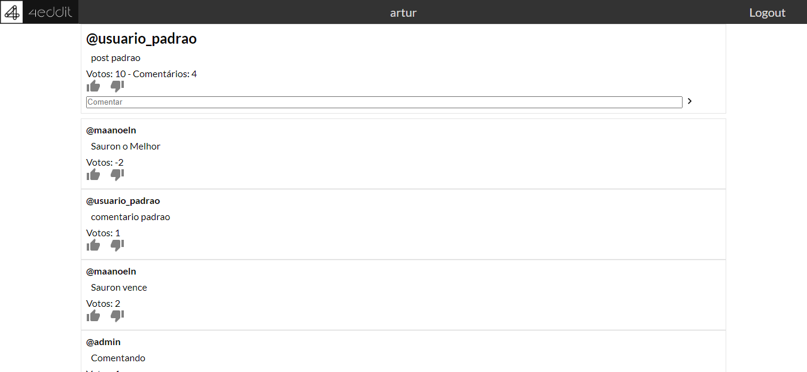

# 4eddit
Projeto para a Labenu baseado no Reddit.

- # Link
  http://reddit.arturmmagalhaes.surge.sh/

- # Telas
  
  
  
  
- # Tecnologias
  O projeto foi desenvolvido com ReactJS.

  - # Dependências
    - React Router DOM
    - Axios
    - Styled-components
    - Material-ui

- # Estrutura do projeto

  O projeto é dividido em Pages, Components, Contexts, Global e Services.
    - Pages contém os componentes necessários para a página específica.
    - Components possui cada componente de forma independente.
    - Contexts possuem as props globais.
    - Global contém estilos e imagens globais.
    - Services possui baseUrl para conectar com a API.

- # Como rodar o projeto
  $ git clone https://github.com/arturmmagalhaes/4eddit.git
  $ cd 4eddit
  $ npm install
  $ npm run start

- # Como deployar o projeto
  $ npm run build
  $ surge ./build [url-desejada]
  
