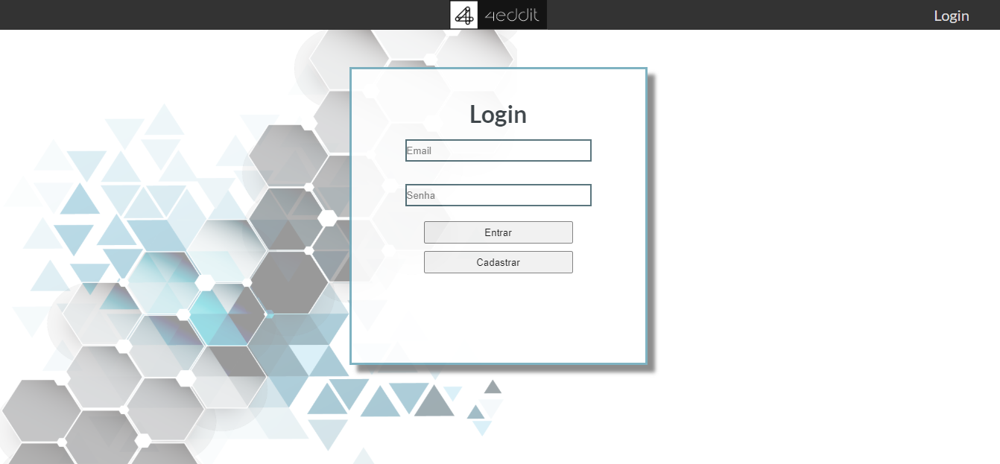

<h1 align="center">@4eddit</h1>
Projeto para a Labenu baseado no Reddit.

  ## Link
  http://reddit.arturmmagalhaes.surge.sh/

- ## Telas
  
  
  
---
- ## 💻️ Tecnologias
  O projeto foi desenvolvido com ReactJS.

  - # Dependências
    - React Router DOM
    - Axios
    - Styled-components
    - Material-ui
    
- ## Estrutura do projeto

  O projeto é dividido em Pages, Components, Contexts, Global e Services.
    - Pages contém os componentes necessários para a página específica.
    - Components possui cada componente de forma independente.
    - Contexts possuem as props globais.
    - Global contém estilos e imagens globais.
    - Services possui baseUrl para conectar com a API.
---
- ## Como rodar o projeto

  Para copiar o projeto:
```bash
  $ git clone https://github.com/arturmmagalhaes/4eddit.git
  $ cd 4eddit
```
  Para instalar as dependências e rodar o sistema:
```bash
  $ npm install
  $ npm run start
```
---
- # Como deployar o projeto
```bash
  $ npm run build
  $ surge ./build [url-desejada]
```

Feito por: Artur Magalhães, Thiago Stephen e Victor Gutierrez.
